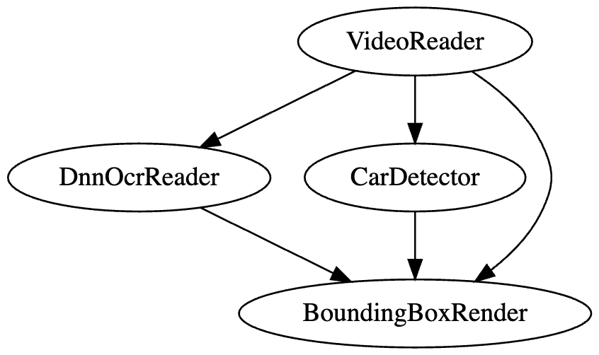
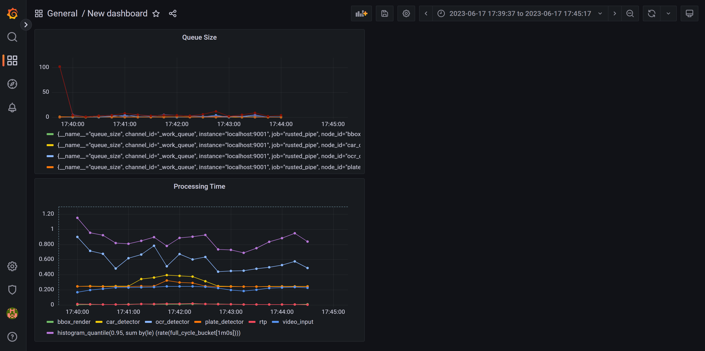
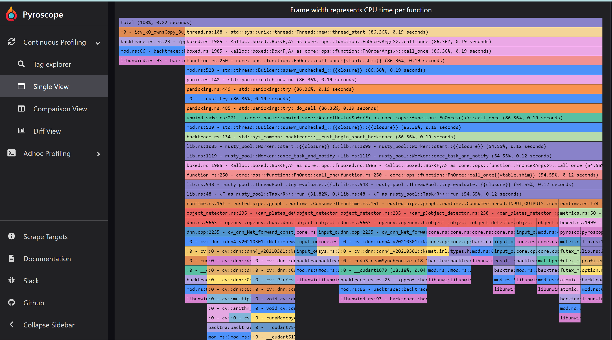

# Rusted Pipe

Real time processing library for developing multithreaded ML pipelines, written in Rust.

# What is it?

This projects aims at simplifing the creation of inference pipelines. Such systems process data streams coming from 1 or more sources and pipe together several processing steps sequentially or in parallel depending on the goal to achieve. These processing steps form a computational graph that runs at high frame rate. Each node of the graph can have more than 1 input necessary for its computation. This software makes the data flow and synchronization a trivial problem for developers.

An example graph could be a pipeline for reading car plates in a vidoe feed, which could look like the following graph:


Car detector and OCR can run in parallel as they work on the data independently but they produce at different speed. We can also run the sequential but the overall throughput would be slower.
Finally the result could look like this depending on the synchronization strategy (more on this below).


Rusted pipe is not a data processing tool and does not solve other parallelism problems such as data parallelism. For that there are already powerful tools such as [Rayon](https://github.com/rayon-rs/rayon). In fact `Rayon` ca be used inside calculators. Similarly this tool is not a competitor of GStreamer. In the examples you will see how to integrate GStreamer with RustedPipe.

# Examples

Minimal example at https://github.com/szandara/rusted_pipe_examples/tree/master/your_first_pipeline.

Check out more pipeline examples at https://github.com/szandara/rusted_pipe_examples.

## Synchronization

Rusted Pipe offers common synchronization strategies but also allows users to create their own. Out of the box Rusted pipe offers the following syncrhonizers:

- TimestampSychronizer: This synchronizer only matches tuple of data if their timestamp match exactly. It's suited for offline computations and data processing. It will try to process any incoming data. If one of the node drops a packat, it might hang the pipeline indefinitely. For that reason buffers should be big enough to account for slow processors.

- RealTimeSynchronizer: This synchronizer is more suited for real time computations. It deals with potential data loss from slow consumers dropping packets. There are three main variables to control the behavior depending on the user.
  - `wait_all`: Only outputs tuple if all buffers in the channel have a match. If false, processors might be called with only some of their read channel data. Processors should take into account lack of data.
  - `tolerance_ns`: Nano seconds of tolerance when matching tuples. 0 tolerance will only match exact versions.

To explain a bit better the problem of synchronization, let's take the graph explained above. Since all consumers produce data at different times, it's not trivial to make sure that all data is processed in a meaningful way. 

In this example there are 4 nodes running at different speed (on an M1 Apple CPU). This is an artifically bad case since consumers should strive for being fast to keep up with realtime. However, it explains how data is synched.

- A video producer running at 25 fps.
- A car deep learning model running at 2 fps.
- An OCR tesseract model running at ~1.2 fps.
- A result renderer thath collects video images and inference results and generates an output.


| TimestampSychronizer (offline)      | RealTimeSynchronizer (~1.2 FPS overall)
| ----------- | ----------- |
| |  |

## Observability

Rusted pipe is integrated with prometheus metrics and a profiler. Both instruments can be turned on and off for performances. Metrics are by default turned on on each Node. Profiling needs to be explicitely turned on.

### Metrics

By default RustedPipe offers metrics at `http://localhost:9001/metrics`, this can be changed by configuring the Graph instruments.

Pass your constructed Prometheus url to change the port.
```
let metrics = Metrics::builder().with_prometheus(&default_prometheus_address());
let mut graph = Graph::new(metrics);
```

The default metrics are:
- Queue sizes: number of elements in each Node queue, useful to monitor how your pipeline is behaving. Growing queues are usually a symptom of a suboptimal graph setup.
- Processing time: provides an end to end processing time but also the processing time of each node. Useful to understand where to optimize your queue.

In order to consume these metrics you need to have Prometheus running and a visualizer like Grafana. The final result would be as below. To configure Grafana and Prometheus please follow one of the many online guides.



### Profiler

By default Rusted Pipe comes with a Pyroscope profiler which (contrarily from Prometheus) is set in push mode. If activated Pyroscope will send metrics each 10 seconds to a Pyroscope server. To create that endpoint please install Pyroscope in your system or remotely and configure the Graph to send metrics there.

Note that activating the profiler will add a certain overhead to your computation and should only be used for development.

In the code snippet below, we start a graph with a profiler activated.

```
let metrics = Metrics::builder().with_pyroscope(&default_pyroscope_address());
let mut graph = Graph::new(metrics);
```

Each node will create a tag with its id and will help profiling the node computation time.




## Motivations

Roboticists often use something like ROS to create nodes which behave like services to process this data in parallel and move it to the next node in the computational graph. However, such message exchange suffer from serialization issues which has been tackled in different ways.

More frameworks exist that solve the same problem using in-memory buffers. Two notorious frameworks are GStreamer and Mediapipe (more in Alternatives). RustedPipe improves on top of those existing systems:
- Strict typing (pipeline fails at compile time).
- Rust memory management will make it hard to share invalid data.
- Comes with simplified time sycrhonization between nodes.
- 100% Rust written.

## Alternatives

Mediapipe has inspired a lot of this work, however, this library tries to overcome some limitations of it.
- Lack of strict typing. Mediapipe Calculator interface is `Process(CalculatorContext* cc)`, where a Calculator is a processing node of your computational graph. Data is casted to the expected type but there is no check at compile time.
- Mediapipe focuses on algorithmic distribution. Most of the code is bound to their calculator and algorithms and it's hard to integrate or extend mediapipe with your own calculators unless you work in the Bazel ecosystem.
- Mediapipe has no Rust support and has no compiler help (unlike Rust) for managing data exchange. One can easily mess up memory access by passing around references.

Gstreamer is not a direct competitor of Rusted Pipe but it's often mentioned as alternatives. Some have built similar tools on top of Gstreamer (ie. DeepStream or https://nnstreamer.ai/). While such libraries are powerful they suffer from usability issues:
- Nodes interfaces follow the same pattern as Mediapipe with no typing.
- In general creating your own processing units for GStreamer is complex and the learning curve is high. GStreamer pipeline compilation is relatively hard to understand and relies on OS system libraries to exists.
- While GStreamer has recently pushed for Rust support the usability has not change.


## Key Concepts

See [docs/README.md](docs/README.md)

## Contributing
- Clone the package
- Branch off for your MR
- Run the tests
- Send pull requests against  [repository](https://github.com/szandara/rustedpipe). 
